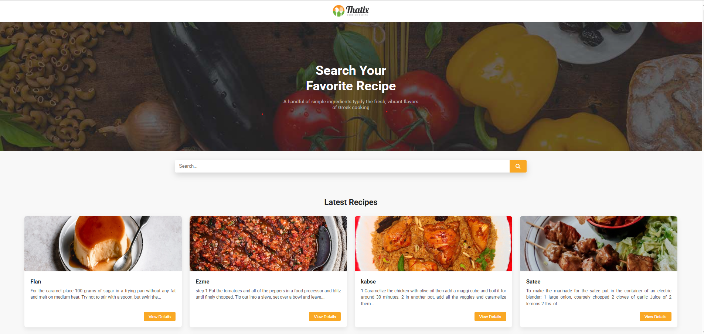
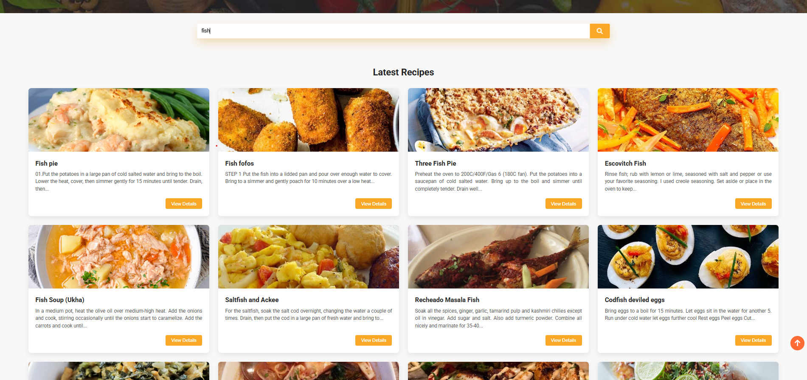

<!--
# Assignment : 04

### Name : Sazid Hasan Sarker

### Email: sarkersazid123@gmail.com

[ Live url](https://thatixrecipefinder.netlify.app/)
-->

# 🍽️ Thatix - Recipe Finder

Thatix is a responsive recipe finder web application that allows users to search for recipes and explore detailed cooking information. The application uses TheMealDB API to fetch recipe data dynamically and displays ingredients, cooking instructions, and relevant external links.

## 📸 Project Screenshot






## 🚀 Live Link

🔗 [Visit Thatix Recipe Finder](https://thatixrecipefinder.netlify.app/)

## 🛠️ Technologies Used

- HTML5
- CSS3
- JavaScript (ES6+)
- TheMealDB API
- Font Awesome
- Google Fonts (Roboto)

## ✨ Main Features

- 🔍 Search recipes by name
- 🍽️ Display recipes dynamically from TheMealDB API
- 📱 Responsive design for desktop, tablet, and mobile devices
- 🖼️ Recipe cards with food images and short descriptions
- 📖 View detailed recipe information in a modal
- 🧂 Display ingredients and measurements
- 👨‍🍳 Display complete cooking instructions
- ▶️ YouTube recipe video link when available
- 🔗 Source link when available
- ⏳ Loading animations while fetching data
- 🔝 Smooth scroll-to-top button
- ✨ Card and button hover animations

## 📦 Dependencies

This project does not require any npm packages or package installation.

The project uses the following external resources through CDN:

- **Font Awesome 6.5.0** — for icons
- **Google Fonts (Roboto)** — for typography
- **TheMealDB API** — for recipe data

## 💻 How to Run Locally

### 1. Clone the repository

```bash
git clone https://github.com/SazidHasan2003/thatix-recipe-finder.git

```

### 2. Navigate to the project folder

```bash
cd thatix-recipe-finder
```

### 3. Run the project

- Open the project folder in **Visual Studio Code**.

- Install the **Live Server** extension if it is not already installed.

- Then right-click on `index.html` and select **Open with Live Server**.

- The project will open in your default web browser.
